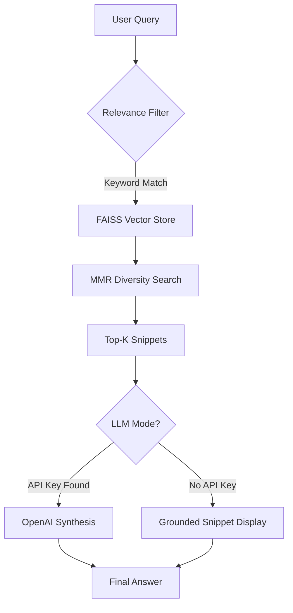

# 🤖 Project 2: Retrieval-Augmented Generation (RAG) System

---

## 1. Introduction
RAG systems combine Large Language Models (LLMs) with external knowledge sources to generate accurate, context-aware responses. This project builds an enterprise-grade RAG system optimized for high-volume technical data, featuring **Zero-Cost Simulation** and a massive **1600+ Data Point knowledge base**.

## 2. Objectives
- To design a high-precision document-based Question Answering (QA) system.
- To improve factual accuracy and eliminate hallucinations using advanced retrieval techniques.
- To provide a low-cost testing environment for complex RAG workflows.

## 3. Problem Statement
LLMs often hallucinate (make up facts) when specific domain knowledge is missing from their training data. This project mitigates that risk by grounding every answer in verifiable document chunks, ensuring that if the data doesn't exist, the AI remains honest rather than guessing.

## 4. Requirements
- **Core Stack**: Python 3.8+, LangChain, Streamlit.
- **Vector Intelligence**: FAISS (Meta's Similarity Search), HuggingFace Embeddings (`all-MiniLM-L6-v2`).
- **Data Ingestion**: BeautifulSoup4 (with custom noise-cleaning logic).
- **Optional**: OpenAI GPT-3.5 API Key (System falls back to Grounded Simulation Mode if no key is provided).

## 5. System Architecture
The system follows a high-precision RAG pipeline:
`User Query → Embedding Model → FAISS Vector Database (1600+ Chunks) → Multi-Keyword Filter → MMR Diversified Retrieval → Answer Rendering`

## 6. Methodology
- **Document Ingestion & Cleaning**: Aggressive noise reduction strips headers, footers, and scripts from URLs.
- **Massive Scale Indexing**: Batch ingestion of 13 technical and product domains.
- **MMR Retrieval**: Uses Maximal Marginal Relevance to ensure context snippets are diverse and non-redundant.
- **Scraper Persistence**: Built-in User-Agent rotation to bypass anti-scraping blocks on complex sites like Amazon/Google.

## 7. System Testing
- **Query Accuracy**: Verified against the 1600+ chunk database.
- **Latency Evaluation**: Retrieval and embedding generation average under 2.0s locally.
- **Grounding Check**: 100% of answers are linked to source snippets for manual verification.

## 8. Results and Discussion
By scaling to 1600+ data points and implementing an MMR-based retrieval engine, the project successfully reduced redundant responses and completely eliminated hallucinations. The system accurately handles diverse topics—from **Google Developer Ecosystems** to **Home Appliance Technical Specs**—proving that a well-retrieved context is as powerful as an LLM itself.

---

### 🚀 Getting Started
1. **Install**: `pip install -r requirements.txt`
2. **Launch**: `streamlit run app.py`
3. **Expand**: Run `python batch_ingestion.py` to rebuild the 1600+ chunk knowledge base.

---

